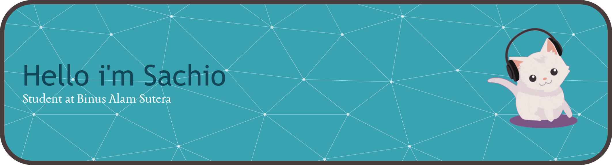

###

<h2 align="left">My name is Sachio Akeno Chan  Student at Binus Alam Sutera</h2>

###

<h4 align="left">I’m currently learning Software Engineering</h4>

###

<h2 align="left">Skills</h2>

###

  
  
  
  
  
  
  
  
  

###

  
  

###

### 🔝 Top Contributed Repo

---

<!-- Proudly created with GPRM ( https://gprm.itsvg.in ) -->
###

  
  

###